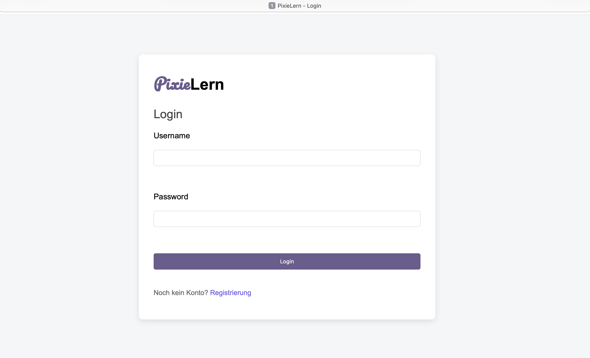
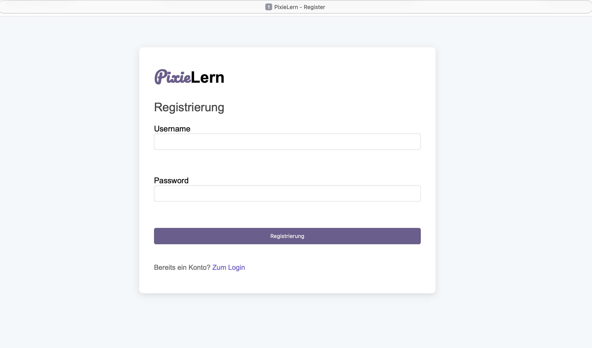
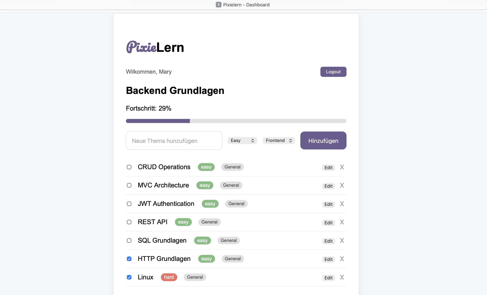

# PixieLern IT Tracker

PixieLern is a Full-Stack Webanwendung zur Verfolgung des Lernfortschritts in IT-Themen.
Dieses Projekt wurde als persönliches Lernprojekt entwickelt, um meine Kenntnisse in der Full-Stack-Entwicklung zu vertiefen.

Live Demo:
https://github.com/mariia-ae/PixieTech-fullstack

## Funktionen
- Benutzerregistrierung und Login
- Passwort-Hashing mit bcrypt
- Persönliches Dashboard für jeden Benutzer
- Themen hinzufügen, bearbeiten und löschen
- Themen als abgeschlossen markieren
- Fortschrittsanzeige (Progress Bar)
- Schwierigkeitsstufen (easy, medium, hard)
- Kategorien (z.B. Frontend, Backend, General etc.)
- Benutzerbezogene Datenspeicherung

## Technologien
Frontend

- HTML
- CSS
- JavaScript (Vanilla)
- LocalStorage

Backend

- Node.js
- Express.js
- SQLite3
- bcrypt

## Architektur
Die Anwendung basiert auf einer klassischen Client-Server-Architektur.
- Das Frontend (HTML, CSS, JavaScript) ist für die Benutzeroberfläche,
  ind die Interaktion mit dem Benutzer verantwortlich.
  
- Das Backend (Node.js mit Express.js) verarbeitet die Anfragen, verwaltet die
  Benutzerregistrierung und Login sowie die Anwendungslogik.
  
- Die Daten werden in einer SQLite-Datenbank gespeichert unnd sind benutzerbezogen organisiert.
  
- Die Kommunukation zwischen Frontend und Backend erfolgt über HTTP-Anfragen.

## Projektstrukture
backend_PL/
index.js
database.db

frontend_PL/
login.html
register.html
dashboard.html

js/
login.js
register.js
dashboard.js

css/
style.css

## Installation
Respository klonen:
git clone http://github.com/mariia-ae/PixieLern-it-tracker.git

# Backend installieren und starten:
cd backend_PL
npm install
node index.js
# Frontend starten:
frontend_PL/login.html öffnen

## Projektstatus
Das Projekt wird aktuell weiterentwickelt.
Geplante Verbesserungen:
- Deployment
- Verbesserte Sicherheit
- UI/UX Verbesserungen

## Autorin
Mariia Chertkova
Diesed Projekt wurde von mir während meiner Umschulung zur 
Fachinformatikerin für Anwendungsentwicklung entwickelt.

GitHub:
http://github.com/mariia-ae

## Screenshots
###  Login

### Registrierung

### Dashboard

