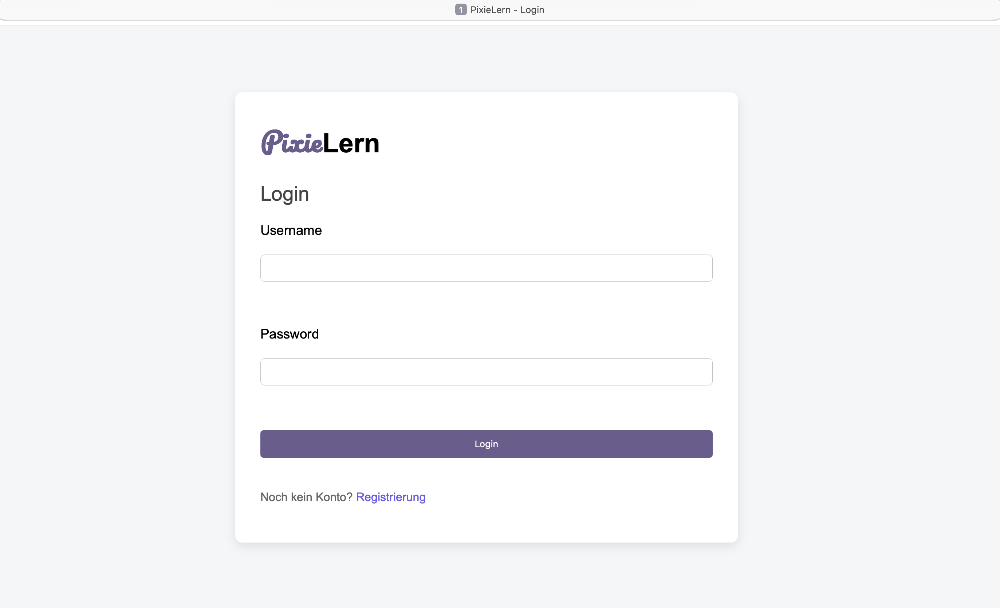
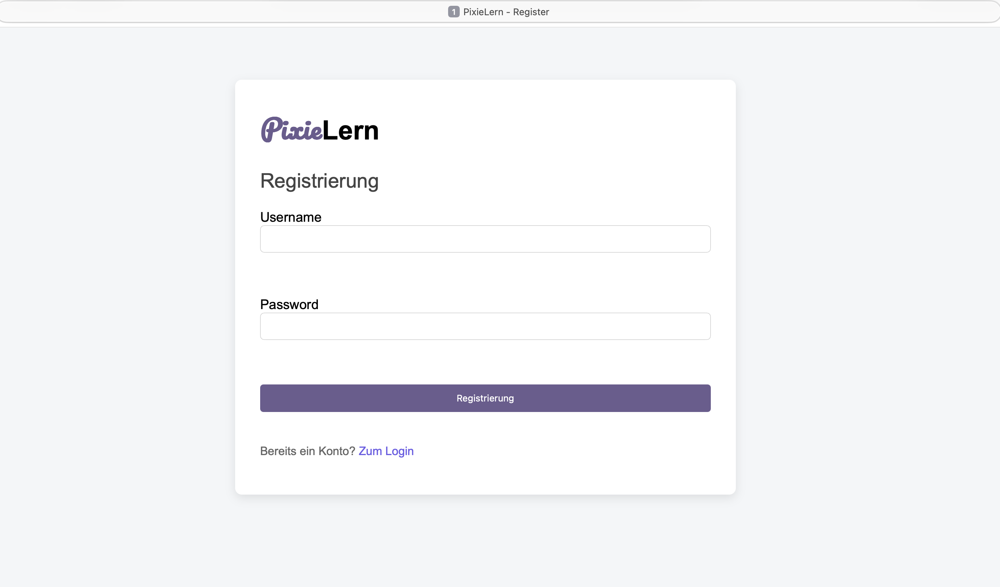
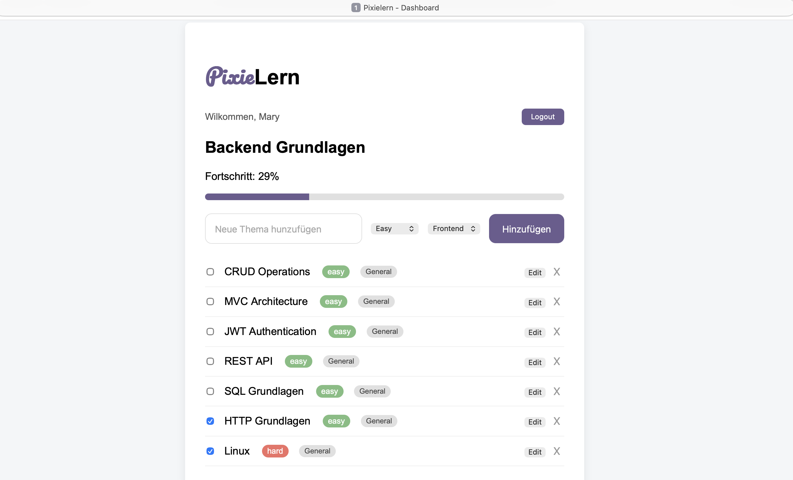

# PixieLern IT Tracker

PixieLern is a full-stack web-application designed to help users track their progress while learning IT topics.
The application provides user authentication, personalized dashboards, progress tracking and topic management features.

Live Demo:
https://pixielern-it-tracker-1.onrender.com/login.html

## futures 
- User registration and authentication
- Secure password hashing using bcrypt
- Personalozed user dashboard
- Create, edit and delete learning topics
- Mark topics as completed
- Progress tracking with visual progress indicators
- Difficulty levels (Easy, Medium, Hard)
- Topic categorization (Frontend, Backend, General, etc.)
- User-specific data storage

## Tech Stack
### Frontend
- HTML
- CSS
- JavaScript (Vanilla)

### Backend
- Node.js
- Express.js

  ### Database
- SQLite3

  ### Security
- bcrypt password hashing

## Archicture
The application follows a classic client-server architecture.
-  Frontend:  HTML, CSS and JavaScript provide the user interface.
-  Backend: Node.js and Express.js handle business logic, authentication and data processing.
-  Database: SQLite stores user accounts and learning data.
-  Communication: Frontend and backend communicate through HTTP request.

## Projct Goal
The goal of this project was to gain hands-on experience in full-stack web-development by building a complete learning managment application from scratch.
The ptoject focuses on authentication. user-specific data managment, CRUD operations and backend development with Node.js and Express.

## Future Improvements
- JWT authentication
- REST API refactoring
- Docker containertization
- Resposive mobile gesign
- Advanced analytics dashboard

## Key Learning Outcomes
- Authentication and authotization fundamentals
- Password security using bcrypt
- CRUD application development
- Client-server communication
- Database integration
- Full-stack project deploment

## Screenshots
###  Login

### Registrierung

### Dashboard

